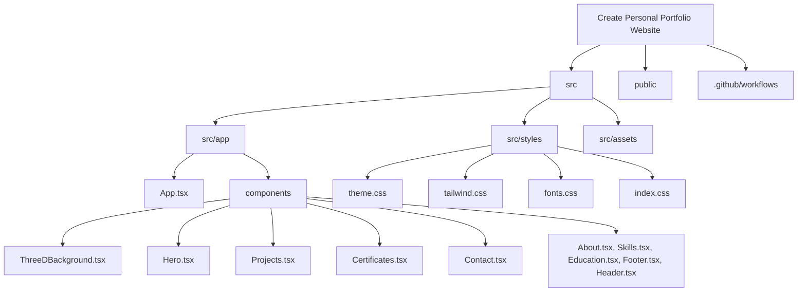

# Somil Portfolio Neural Engine Brain Dump (`brain.md`)

This document serves as the persistent source of truth, technical spec, and progress report for the **Somil Mittal Personal Portfolio Website**. It outlines the project's architecture, design tokens, component breakdown, active integrations, deployment workflows, and current progress. Use this file to avoid redundant analysis and preserve codebase context.

---

## 🌌 Project Overview
- **Owner / Profile:** Somil Mittal — BCA (AI & ML) Student, AI/ML developer, and tech enthusiast based in Jaipur, India.
- **Theme Concept:** "Neural Engine Activated" — A premium, high-fidelity, interactive 3D/cyberpunk portfolio with dark-mode optimizations, glowing glassmorphism elements, neon color schemes, and micro-interactions.
- **Workspace Root:** [Create Personal Portfolio Website](file:///c:/Users/sanum/Downloads/Create%20Personal%20Portfolio%20Website)

---

## 🛠️ Technology Stack & Dependencies

The project is built using a modern, performant, and visual-first web stack:

### 1. Core & Build System
- **Framework:** React 18+ & TypeScript
- **Bundler / Build Tool:** [Vite v6](file:///c:/Users/sanum/Downloads/Create%20Personal%20Portfolio%20Website/vite.config.ts) (configured with `@vitejs/plugin-react`)
- **Package Manager:** NPM / PNPM (overrides in place for Vite version consistency)

### 2. Styling & Layout
- **CSS Engine:** Tailwind CSS v4 (using `@tailwindcss/vite` integration)
- **Theme Definition:** [src/styles/theme.css](file:///c:/Users/sanum/Downloads/Create%20Personal%20Portfolio%20Website/src/styles/theme.css) containing:
  - Custom Tailwind v4 `@theme inline` mappings.
  - Dark-mode custom variant configuration (`@custom-variant dark (&:is(.dark *))`).
  - HSL and hex system design tokens (Deep Void background, Electric Purple glows, and Neon Green/Lime accents).
  - Modern fonts setup (Headline: *Sora*, Body: *Plus Jakarta Sans*, Labels/Caps: *Space Grotesk*).

### 3. Animation & Interactions
- **Framing & Transitions:** `motion` (Framer Motion v12, using `motion/react`)
- **Utility CSS Animations:** `tw-animate-css`
- **Dynamic Feedback:** `canvas-confetti` (used upon successful contact form submissions)
- **Icons:** `lucide-react`

---

## 📂 Codebase Directory & File Structure

### Key Configuration Files:
- [package.json](file:///c:/Users/sanum/Downloads/Create%20Personal%20Portfolio%20Website/package.json) — Core dependencies, scripts (`dev`, `build`), and package overrides.
- [tsconfig.json](file:///c:/Users/sanum/Downloads/Create%20Personal%20Portfolio%20Website/tsconfig.json) — TypeScript compiler configurations.
- [vite.config.ts](file:///c:/Users/sanum/Downloads/Create%20Personal%20Portfolio%20Website/vite.config.ts) — Configures React plugin and Tailwind v4 compilation.
- [index.html](file:///c:/Users/sanum/Downloads/Create%20Personal%20Portfolio%20Website/index.html) — Main entry point containing SEO tags, custom fonts loader, theme restoration script (safeguards against dark/light mode flashes), and site verification tags.
- [public/robots.txt](file:///c:/Users/sanum/Downloads/Create%20Personal%20Portfolio%20Website/public/robots.txt) — Directives for search crawlers.
- [public/sitemap.xml](file:///c:/Users/sanum/Downloads/Create%20Personal%20Portfolio%20Website/public/sitemap.xml) — XML Sitemap for indexing search engine optimization.

---

## 🎨 Design System & Aesthetic Tokens

The visual style is configured inside [theme.css](file:///c:/Users/sanum/Downloads/Create%20Personal%20Portfolio%20Website/src/styles/theme.css) and uses custom color mappings:

| Token Name | HEX Code / Value | CSS Variable | Visual Application |
| :--- | :--- | :--- | :--- |
| **Deep Void** | `#020617` | `--deep-void` | Core website background (Dark mode) |
| **Electric Purple** | `#8B5CF6` | `--electric-purple` | Glows, ambient lights, highlights |
| **Primary Container** | `#c3f400` | `--primary-container` | Neon lime/green highlights & primary action buttons |
| **Secondary Container** | `#ff4a8d` | `--secondary-container` | Neon pink/magenta badges & highlights |
| **Tertiary Fixed Dim**| `#00daf3` | `--tertiary-fixed-dim` | Neon cyan badges & interactive accents |
| **Surface Dim** | `#0b1326` | `--surface-dim` | Card container background (Dark mode) |
| **Glass White** | `rgba(255,255,255, 0.1)` | `--glass-white` | Glassmorphism borders and overlay panels |

---

## 🧩 Detailed Component Analysis

### 1. Main Wrapper & Global Controls
- **[App.tsx](file:///c:/Users/sanum/Downloads/Create%20Personal%20Portfolio%20Website/src/app/App.tsx):** Assemblies all sections (Hero, About, Skills, Projects, Education, Certificates, Contact, Footer) inside a relative container. Renders the `<ThreeDBackground />` fixed behind everything and mounts the Sonner `<Toaster />` for global message notifications.

### 2. Interactive Background
- **[ThreeDBackground.tsx](file:///c:/Users/sanum/Downloads/Create%20Personal%20Portfolio%20Website/src/app/components/ThreeDBackground.tsx):** Uses HTML5 Canvas context (`2d`) for a magnetic dot-grid system:
  - Draws a dense spacing grid representing neural synapses.
  - Distorts grid coordinates in real-time based on mouse positioning (applies repulsion/attraction fields).
  - Renders glowing shooting stars crossing the canvas at timed intervals.
  - Dynamically updates color values based on current active CSS variables (dark vs. light theme colors).

### 3. Header & Navigation
- **[Header.tsx](file:///c:/Users/sanum/Downloads/Create%20Personal%20Portfolio%20Website/src/app/components/Header.tsx):** 
  - Sticky glassmorphism header with active link highlighting using scroll detection.
  - Features the brand logo "Somil Mittal" styled with neon drop shadow gradients.
  - Implements theme toggle (defaults to dark mode, saves state to `localStorage`, and updates `document.documentElement` `.dark` class).
  - Mobile responsive dashboard drawer navigation menu with active hover indicators.

### 4. Hero Section
- **[Hero.tsx](file:///c:/Users/sanum/Downloads/Create%20Personal%20Portfolio%20Website/src/app/components/Hero.tsx):**
  - Cyberpunk-styled headline layout: *"NEURAL ENGINE ACTIVATED // BCA (AI & ML)"*.
  - Incorporates floating holographic 3D brain central composition (referenced from cloud asset).
  - Handles resume PDF download, redirection to projects, and contact forms.
  - Connects social links to GitHub and LinkedIn.

### 5. Skills
- **[Skills.tsx](file:///c:/Users/sanum/Downloads/Create%20Personal%20Portfolio%20Website/src/app/components/Skills.tsx):**
  - Renders technical skills (Python, C, HTML/CSS/JS, AI/ML) via custom progress bars animating when scrolled into view.
  - Highlights tools and environments (VS Code, Flutter, Git Bash/GitHub, Canva, Figma) in card formats with interactive scale transformations on hover.

### 6. Projects Showcase
- **[Projects.tsx](file:///c:/Users/sanum/Downloads/Create%20Personal%20Portfolio%20Website/src/app/components/Projects.tsx):**
  - Titled **"Mechanical Modules"**.
  - Custom horizontal carousel rendering 3D-isometric project cards.
  - Supports scroll snap, custom grab-to-drag horizontal scrolling, status badges (e.g. `STATUS: ACTIVE`, `STATUS: SYNCED`), and source code buttons.
  - Projects listed:
    1. *Code Connect* (GDG Hackathon 1st Place) — Collaboration platform.
    2. *Face Recognition Attendance System* — OpenCV face validation.
    3. *Laundry Management System Software* — Database order manager.
    4. *AI Finance Advisor SaaS Platform* — Financial advisor dashboard.

### 7. Education & Experience
- **[Education.tsx](file:///c:/Users/sanum/Downloads/Create%20Personal%20Portfolio%20Website/src/app/components/Education.tsx):**
  - Titled **"Education & Experience"**.
  - Vertical chronological timeline displaying education milestones and work experience cards.
  - Dynamically distinguishes between work (using the `Briefcase` icon) and education (using the `GraduationCap` icon).
  - Highlights:
    1. *Web Development Intern* at Codveda Technologies (May 2026 - June 2026).
    2. *Bachelor of Computer Application (AI & ML)* at Poornima University (Aug. 2025 - Present).
    3. *Student Chapter Member* at Association for Computing Machinery (ACM) (Jan. 2026 - Present).

### 8. Certificates & Badges
- **[Certificates.tsx](file:///c:/Users/sanum/Downloads/Create%20Personal%20Portfolio%20Website/src/app/components/Certificates.tsx):**
  - Renders PDF and image credential certificates (Gemini Certified Student, NPTEL Certification, Python DSA Completion by Unstop, 1st Place — Let's Hack It Hackathon by GDG, and Web Development Internship by Codveda Technologies).
  - Integrates an interactive overlay preview Modal to display both PDF documents (via iframe) and image files (via img) directly in-app, alongside split buttons supporting both instant visual previewing and external tab redirection.
  - Dynamically embeds and renders Credly digital badges using the external script loader helper:
    - Badges embed URL: `//cdn.credly.com/assets/utilities/embed.js`.
    - Script mounts on component load and compiles badges based on individual Credly IDs.

### 9. Contact Form
- **[Contact.tsx](file:///c:/Users/sanum/Downloads/Create%20Personal%20Portfolio%20Website/src/app/components/Contact.tsx):**
  - Form validation handled by `react-hook-form`.
  - Sends responses asynchronously via **POST** requests to a custom **Google Apps Script Web App Endpoint**:
    - Script URL: `https://script.google.com/macros/s/AKfycbyABzKntZeAmtPAmPdXgBNkaseLEYLteJI9TXXbptfFyEevH9pbioDbub8q_Zyfmd83/exec`
    - Uses `mode: 'no-cors'` configuration for secure execution without CORS blockage.
  - Displays toast success confirmations and resets form fields on success.

---

## 🚀 CI/CD & Deployment Pipeline

- **Platform:** GitHub Pages
- **Configuration Workflow:** [.github/workflows/deploy.yml](file:///c:/Users/sanum/Downloads/Create%20Personal%20Portfolio%20Website/.github/workflows/deploy.yml)
- **Process:**
  1. Triggers on any pushes to the `main` branch or manual `workflow_dispatch`.
  2. Runs builds inside an Ubuntu container utilizing Node 20.
  3. Installs dependencies using `npm ci`.
  4. Bundles static outputs via `npm run build` (outputs to the `/dist` directory).
  5. Deploys the content of `/dist` directly to GitHub Pages environments utilizing standard actions: `actions/upload-pages-artifact@v3` and `actions/deploy-pages@v4`.

---

## 📈 Current Project Progress & Status Report

### ✅ Completed Milestones
- **Responsive Layout & CSS Setup:** Configured Tailwind v4 with custom tokens inside `theme.css`. Responsive design optimized across mobile, tablet, and desktop views.
- **Theme Control:** Implemented light and dark mode toggles without initial flashes, defaulting to dark mode initially and saving preferences in `localStorage`.
- **Canvas Physics Engine:** Programmed magnetic repulsion dot grids and shooting star effects.
- **Projects Showcase Carousel:** Deployed drag-to-scroll carousel featuring 3D isometric styled cards.
- **Google Sheet Integration:** Linked the contact form to custom Google Sheets Apps Script endpoint.
- **Certifications & Badges:** Integrated PDF certifications alongside automated dynamic embeds for Credly badges, styled inside custom neon-glowing glass mechanical panels.
- **SEO & AEO Optimizations:** Formulated `sitemap.xml`, `robots.txt`, custom favicons, and verified Google site owner search credentials. Added a high-fidelity website title, OpenGraph tags, Twitter Card tags, and structured JSON-LD schema markup (`@type: Person`) detailing Somil's job title, skills, education, and credentials for Answer Engine compatibility.
- **Footer Structure & Style Reversion:** Restored the clean 3-column footer layout (Brand, Quick Links, Availability Status) and the bottom copyright bar, styled in high-fidelity glassmorphism with metallic/tech details, custom neon icons, and hardware screws.
- **Global Visual Redesign:** Upgraded Header, About profile frame, Skills progress bars, Education timeline components, and Contact form inputs/buttons to adhere to a premium cyberpunk/3D neon aesthetic with responsive glass container components.
- **Brand Logo Integration:** Embedded the custom monogram "SM" logo image (`logo.png`) inside the sticky glassmorphism header, the footer brand info card, and configured it as the browser's high-fidelity tab favicon.
- **Workspace Cleanup:** Deleted unused HTML layout drafts, design screenshots, and temporary web assets from the project root to keep the workspace clean and focused.

### 📋 Pending / Future Enhancements
- [ ] Optimize 3D brain images / media sizes to reduce site load times on mobile.
- [ ] Establish automated unit tests for key component renderings.
- [ ] Add further micro-animations on interactive badges in the About section.
- [ ] Implement lazy loading for iframe or badges loading from external domains (e.g. Credly script loading fallback on low connection).

---

> [!NOTE]
> When modifying components, always check if styles are controlled via global tokens in `theme.css` to preserve the unified glowing aesthetic. Avoid hardcoded tailwind values when standard color variables are available.
